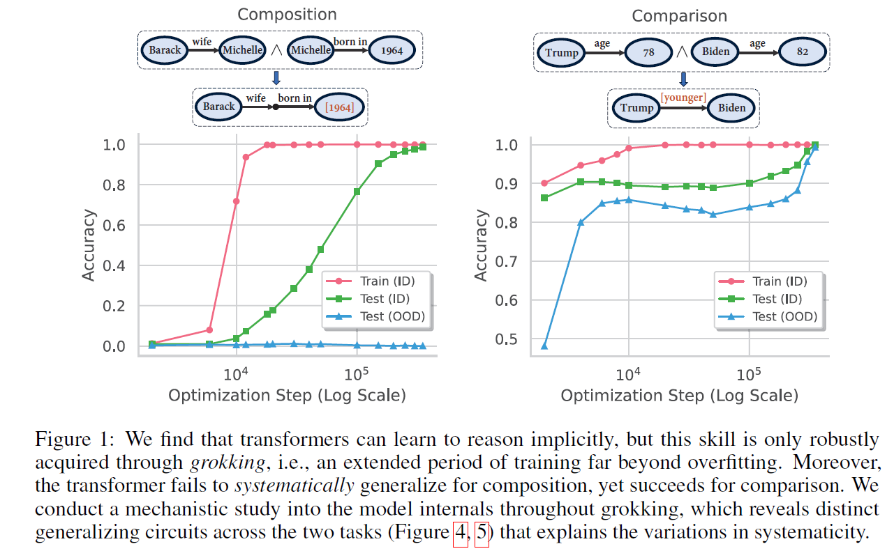

## [NeurIPS'24] Grokked Transformers are Implicit Reasoners: A Mechanistic Journey to the Edge of Generalization (https://arxiv.org/abs/2405.15071)

>We study whether transformers can learn to implicitly reason over parametric knowledge, a skill that even the most capable language models struggle with. Focusing on two representative reasoning types, composition and comparison, we consistently find that transformers can learn implicit reasoning, but only through grokking, i.e., extended training far beyond overfitting. The levels of generalization also vary across reasoning types: when faced with out-of-distribution examples, transformers fail to systematically generalize for composition but succeed for comparison. We delve into the model's internals throughout training, conducting analytical experiments that reveal: 1) the mechanism behind grokking, such as the formation of the generalizing circuit and its relation to the relative efficiency of generalizing and memorizing circuits, and 2) the connection between systematicity and the configuration of the generalizing circuit. Our findings guide data and training setup to better induce implicit reasoning and suggest potential improvements to the transformer architecture, such as encouraging cross-layer knowledge sharing. Furthermore, we demonstrate that for a challenging reasoning task with a large search space, GPT-4-Turbo and Gemini-1.5-Pro based on non-parametric memory fail badly regardless of prompting styles or retrieval augmentation, while a fully grokked transformer can achieve near-perfect accuracy, showcasing the power of parametric memory for complex reasoning.




### File Structure
```
GrokkedTranformer/
├─  {composition/comparison/complex_reasoning}.ipynb: scripts for training/evaluation data generation
├─  data/: cached training/evaluation data
├─  main.py: main script for model training
├─  eval_qa.py: evaluation script for trained model
├─  causal_tracing_{composition/comparison}.py: causal tracing & logit lens
├─  LLM/: cached testing data & model outputs for LLMs based on non-parametric memory
    ├─ {prompt/retrieval}_{directna/cot}_*.txt: input for the setting {without/with} retrieval augmentation and {without/with} CoT
    ├─ answer_*.txt: ground truth answer
    ├─ {gemini/gpt4turbo}_*.txt: predictions of Gemini-Pro-1.5 and GPT-4-Turbo
├─  LLM.ipynb: evaluation script and cached evaluation results for LLMs
└── utils.py: other helper functions
```

### Environmental Setup
```bash
pip install torch==1.13.1+cu116 torchvision==0.14.1+cu116 torchaudio==0.13.1 --extra-index-url https://download.pytorch.org/whl/cu116

cd transformers
pip install -e .
cd ..

cd simpletransformers
pip install -e .
cd ..
```

### Data Preparation
- Download from [link](https://buckeyemailosu-my.sharepoint.com/:f:/g/personal/wang_13930_buckeyemail_osu_edu/EghpRAb3V71FnQsi44nuAfsB47HZSmmWuxt5DML2hqtM7w?e=TWeYkW) and unzip into data/, or alternatively, run ```{composition/comparison/complex_reasoning}.ipynb``` to generate the data
- Download from [link](https://buckeyemailosu-my.sharepoint.com/:f:/g/personal/wang_13930_buckeyemail_osu_edu/EiTbt6SLSLhLrJd_kgJJBtIBPerEzHziFVsmn98pP8sSZQ?e=KUaI0d) and unzip into LLM/

### Model Training
```bash
MODEL_PATH=gpt2

DATASET=data/$1/
WEIGHT_DECAY=$2
N_LAYERS=$3
GPU=$4

OUTPUT_DIR=<your_dir>/$1_$2_$3

# CUDA_VISIBLE_DEVICES=0,1,2,3 python -m torch.distributed.launch --nproc_per_node=4 --master_port 12345 main.py \
CUDA_VISIBLE_DEVICES=$GPU python main.py \
--data_dir $DATASET \
--model_name_or_path ${MODEL_PATH} \
--weight_decay $WEIGHT_DECAY \
--output_dir $OUTPUT_DIR \
--max_seq_length 10 \
--max_length 10 \
--block_size 10 \
--train_batch_size 512 \
--eval_batch_size 512 \
--learning_rate 1e-4 \
--gradient_accumulation_steps 1 \
--save_step 50000 \
--save_step_dense 40000 \
--max_steps 1500000 \
--do_train \
--scheduler constant_schedule_with_warmup \
--fp16 \
--evaluate_during_training \
--predict_during_training \
--init_weights \
--add_tokens \
--n_layer $N_LAYERS
```

- For the parameter sharing scheme in Section Appendix E.2, run the above command with ```--n_layer 4``` and ```--add_recurrence``` flag.

- Pretrained model checkpoints could be downloaded from [here](https://buckeyemailosu-my.sharepoint.com/:f:/g/personal/wang_13930_buckeyemail_osu_edu/EtXABU00W65KvWZ4hqKaq6kB7cag7Gi5UUoXH5qMb9AdTg?e=o73sqm), where the directories are named by "<dataset_name>\_<weight_decay>\_<num_layers>" and contain downsampled checkpoints (full checkpoints are too large to upload) during training, labeled by "checkpoint-<training_step>/".

### Evaluation
```bash
python eval_qa.py --dir <path_to_saved_checkpoints>
```

- For LLMs based on non-parametric memory, the cached evaluation scripts and results are included in ```LLM.ipynb```.


### Logit lens & Causal tracing
```bash
python causal_tracing_{comparison/composition}.py \
    --dataset <dataset_name> \
    --model_dir <your_dir> \
    --save_path <your_save_path> \
    --num_layer <number_layer_of_model> \
    --wd <weight_decay_used>
```

### Citation
```
@misc{wang2024grokked,
      title={Grokked Transformers are Implicit Reasoners: A Mechanistic Journey to the Edge of Generalization}, 
      author={Boshi Wang and Xiang Yue and Yu Su and Huan Sun},
      year={2024},
      eprint={2405.15071},
      archivePrefix={arXiv},
      primaryClass={cs.CL},
      url={https://arxiv.org/pdf/2405.15071}
}
```
